# LeadFi CRM - Business Process Flow

This document outlines the complete business process flow for LeadFi CRM, from lead acquisition through customer management and account handoff.

## Business Process Overview

## Detailed Business Workflow

### Phase 1: Lead Acquisition & Import

```mermaid
flowchart TD
    subgraph "Lead Sources"
        subgraph "Manual Entry"
            M1["BD Research<br/>• LinkedIn prospecting<br/>• Event networking<br/>• Cold outreach<br/>• Referrals"]
            M2["Frontend Entry<br/>• Lead forms<br/>• Real-time input<br/>• Immediate processing"]
        end
        
        subgraph "Apollo Research"
            A1["Apollo Platform<br/>• Automated search<br/>• Company targeting<br/>• Contact discovery"]
            A2["CSV Export<br/>• Bulk data download<br/>• apollo_ingest.py"]
        end
        
        subgraph "Company Inbound"
            CO["Company Allocation<br/>• Pre-qualified leads<br/>• Strategic assignments"]
            GS["Google Sheets<br/>• Centralized storage<br/>• sheets_ingest.py"]
        end
    end
    
    subgraph "Processing Layer"
        API["Direct API<br/>Real-time Processing"]
        ETL["ETL Pipeline<br/>Batch Processing"]
    end
    
    subgraph "CRM Integration"
        CRM["LeadFi CRM<br/>Lead Record Created"]
        BD["BD Team<br/>Lead Assignment"]
        S1["Stage 1:<br/>Lead Generated"]
    end
    
    M1 --> M2
    M2 --> API
    
    A1 --> A2
    A2 --> ETL
    
    CO --> GS
    GS --> ETL
    
    API --> CRM
    ETL --> CRM
    CRM --> BD
    BD --> S1
    
    style M1 fill:#e1f5fe
    style M2 fill:#e1f5fe
    style A1 fill:#f3e5f5
    style A2 fill:#f3e5f5
    style CO fill:#fff3e0
    style GS fill:#fff3e0
    style API fill:#e8f5e8
    style ETL fill:#fce4ec
    style CRM fill:#4caf50
    style BD fill:#f1f8e9
    style S1 fill:#ffeb3b
```

### Phase 2: Sales Pipeline Process

```mermaid
flowchart TD
    S1["Stage 1: Lead Generated<br/>🎯 Activities:<br/>• Initial contact<br/>• Lead qualification<br/>• Needs discovery<br/>• Interest assessment"] 
    
    S2["Stage 2: Proposal<br/>📋 Activities:<br/>• Detailed needs analysis<br/>• Solution presentation<br/>• Proposal creation<br/>• Initial pitch meeting"]
    
    S3["Stage 3: Negotiation<br/>🤝 Activities:<br/>• Terms discussion<br/>• Objection handling<br/>• Agreement refinement<br/>• Contract negotiation"]
    
    S4["Stage 4: Registration<br/>📝 Activities:<br/>• Account setup<br/>• Documentation completion<br/>• Onboarding initiation<br/>• System access preparation"]
    
    Decision1{"Qualified<br/>Lead?"}
    Decision2{"Proposal<br/>Accepted?"}
    Decision3{"Terms<br/>Agreed?"}
    Decision4{"Registration<br/>Complete?"}
    
    Lost1["Mark as Lost<br/>Unqualified"]
    Lost2["Mark as Lost<br/>Proposal Rejected"]
    Lost3["Mark as Lost<br/>Terms Disagreement"]
    Lost4["Mark as Lost<br/>Registration Failed"]
    
    S1 --> Decision1
    Decision1 -->|Yes| S2
    Decision1 -->|No| Lost1
    
    S2 --> Decision2
    Decision2 -->|Yes| S3
    Decision2 -->|No| Lost2
    
    S3 --> Decision3
    Decision3 -->|Yes| S4
    Decision3 -->|No| Lost3
    
    S4 --> Decision4
    Decision4 -->|Yes| CC["Customer Conversion<br/>🎉 Lead → Customer"]
    Decision4 -->|No| Lost4
    
    CC --> S5["Stage 5: Integration<br/>Customer Management Phase"]
    
    style S1 fill:#e3f2fd
    style S2 fill:#f3e5f5
    style S3 fill:#fff3e0
    style S4 fill:#ffeb3b
    style CC fill:#4caf50
    style S5 fill:#fce4ec
    style Lost1 fill:#ffcdd2
    style Lost2 fill:#ffcdd2
    style Lost3 fill:#ffcdd2
    style Lost4 fill:#ffcdd2
```

### Phase 3: Customer Management & Analysis

```mermaid
flowchart TD
    subgraph "Integration Phase"
        CM["Customer Management<br/>Stage 5: Integration<br/>🎓 Activities:<br/>• Platform onboarding<br/>• Training & support<br/>• Trading setup<br/>• Initial guidance"]
    end
    
    subgraph "Performance Monitoring"
        VH["VIP History Analysis<br/>📊 Review:<br/>• Past trading behavior<br/>• Account activity<br/>• Engagement levels<br/>• Historical performance"]
        
        TV["Trading Volume Analysis<br/>📈 Monitor:<br/>• Daily trading volume<br/>• Transaction frequency<br/>• Account balance<br/>• Trading patterns"]
    end
    
    subgraph "Requirements Assessment"
        MR["Minimum Requirements Check<br/>✅ Criteria:<br/>• Volume thresholds<br/>• Activity levels<br/>• Account status<br/>• Performance metrics"]
    end
    
    subgraph "Decision & Closure"
        Decision["Meets Requirements?"]
        Won["Stage 6: Closed Won<br/>🏆 Successful client<br/>• Active trading<br/>• Meets criteria<br/>• Platform adoption"]
        Lost["Stage 7: Closed Lost<br/>❌ Below requirements<br/>• Insufficient volume<br/>• Inactive account<br/>• Poor engagement"]
    end
    
    CM --> VH
    CM --> TV
    VH --> MR
    TV --> MR
    MR --> Decision
    Decision -->|Yes| Won
    Decision -->|No| Lost
    
    style CM fill:#fce4ec
    style VH fill:#f1f8e9
    style TV fill:#f1f8e9
    style MR fill:#e3f2fd
    style Won fill:#2e7d32
    style Lost fill:#d32f2f
```

### Phase 4: Account Management Handoff

```mermaid
flowchart LR
    subgraph "Closure Status"
        Won["Closed Won<br/>Active Clients"]
        Lost["Closed Lost<br/>Inactive Clients"]
    end
    
    subgraph "Handoff Process"
        Prep["Handoff Preparation<br/>📋 Documentation:<br/>• Client history<br/>• Trading summary<br/>• Notes & insights<br/>• Account details"]
        
        Transfer["Client Transfer<br/>🔄 Process:<br/>• Account reallocation<br/>• Team notification<br/>• Access transfer<br/>• Responsibility shift"]
    end
    
    subgraph "Account Management"
        AM["Account Management Team<br/>👥 Responsibilities:<br/>• Ongoing relationship<br/>• Account maintenance<br/>• Reactivation efforts<br/>• Long-term support"]
    end
    
    Won --> Prep
    Lost --> Prep
    Prep --> Transfer
    Transfer --> AM
    
    style Won fill:#2e7d32
    style Lost fill:#d32f2f
    style Prep fill:#fff3e0
    style Transfer fill:#e3f2fd
    style AM fill:#ff9800
```

## Business Rules & Criteria

### Lead Acquisition Sources

#### Manual Entry Criteria
- **BD Research**: LinkedIn, events, referrals, cold outreach
- **Real-time Processing**: Immediate API integration
- **Quality Control**: Frontend validation and duplicate checking
- **Source Tracking**: Origin attribution for analytics

#### Apollo Research Criteria  
- **Search Parameters**: Company size, industry, location filters
- **Data Quality**: Contact verification and enrichment
- **Bulk Processing**: CSV export and automated ingestion
- **Deduplication**: Cross-reference with existing leads

#### Company Inbound Criteria
- **Pre-qualification**: Company-vetted lead quality
- **Strategic Priority**: High-value prospect identification
- **Centralized Management**: Google Sheets coordination
- **Regular Sync**: Scheduled data synchronization

### Lead Qualification Criteria
- **Contact Response**: Prospect shows initial interest
- **Basic Qualification**: Meets minimum profile requirements
- **Budget Confirmation**: Has trading capital available
- **Authority**: Decision-making capability confirmed

### Customer Conversion Trigger
- **Registration Complete**: All documentation finalized
- **Account Setup**: Trading account successfully created
- **System Access**: Platform access configured
- **Initial Deposit**: Account funded (if applicable)

### Performance Analysis Metrics

#### VIP History Evaluation
- Previous trading activity
- Account tenure
- Engagement history
- Support interactions
- Platform usage patterns

#### Trading Volume Requirements
- Daily trading volume thresholds
- Minimum transaction frequency
- Account balance maintenance
- Trading consistency
- Activity sustainability

### Closure Decision Logic

#### Closed Won Criteria
✅ Meets minimum trading volume  
✅ Consistent daily activity  
✅ Account in good standing  
✅ Platform engagement  
✅ Sustainable trading patterns  

#### Closed Lost Criteria
❌ Below minimum volume threshold  
❌ Inactive trading account  
❌ Poor platform engagement  
❌ Insufficient activity  
❌ Account issues or concerns  

## Key Performance Indicators

### Lead Source Metrics
- **Manual Entry**: Response rates, conversion quality, BD efficiency
- **Apollo Research**: Search effectiveness, contact accuracy, volume success
- **Company Inbound**: Pre-qualification accuracy, strategic value, pipeline velocity

### Sales Pipeline Metrics
- **Lead Conversion Rate**: Percentage moving through stages by source
- **Stage Duration**: Time spent in each pipeline stage
- **Drop-off Rate**: Leads lost at each stage by acquisition method
- **Registration Success**: Stage 4 completion rate by source

### Customer Success Metrics
- **Integration Success**: Onboarding completion rate
- **Trading Adoption**: Platform usage metrics  
- **Volume Achievement**: Requirements meeting rate
- **Won/Lost Ratio**: Final closure distribution by lead source

### Business Efficiency
- **Time to Customer**: Lead generation to conversion time by source
- **Account Management Load**: Handoff volume and timing
- **Resource Allocation**: BD team efficiency across sources
- **Process Optimization**: Workflow improvement opportunities

## Integration Points

### Current Integrations
- **Manual Entry**: Frontend forms with real-time API
- **Apollo Research**: CSV processing and ETL pipeline
- **Google Sheets**: API integration and automated sync
- **LeadFi CRM**: Central management platform
- **Trading Platform**: Customer activity monitoring
- **Account Management**: Team handoff system

### Future Automation Opportunities
- **Real-time Apollo Sync**: Direct API integration with Apollo platform
- **Enhanced Manual Entry**: Auto-enrichment and duplicate detection
- **Smart Google Sheets**: Automated data validation and quality scoring
- **Performance Monitoring**: Real-time trading analysis
- **Alert Systems**: Threshold-based notifications
- **Handoff Automation**: Streamlined team transfers
- **Cross-source Analytics**: Unified reporting dashboards

## Process Optimization

### Current Strengths
- **Multi-source Flexibility**: Diverse lead acquisition channels
- **Clear Pipeline Stages**: Structured qualification process
- **Defined Conversion Criteria**: Clear customer creation triggers
- **Performance-based Decisions**: Data-driven closure logic
- **Structured Handoff Process**: Organized team transitions

### Improvement Areas
- **Automated Source Sync**: Real-time data integration
- **Cross-source Deduplication**: Enhanced duplicate prevention
- **Predictive Lead Scoring**: AI-powered qualification
- **Real-time Performance Tracking**: Instant trading analysis
- **Enhanced Team Collaboration**: Improved workflow coordination
- **Streamlined Documentation**: Automated reporting

### Success Factors
- **Source Diversification**: Multiple lead acquisition channels
- **Clear Role Definitions**: Defined responsibilities per source
- **Consistent Process Adherence**: Standardized workflows
- **Regular Performance Reviews**: Data-driven optimization
- **Continuous Process Refinement**: Ongoing improvement
- **Team Training and Support**: Multi-source expertise