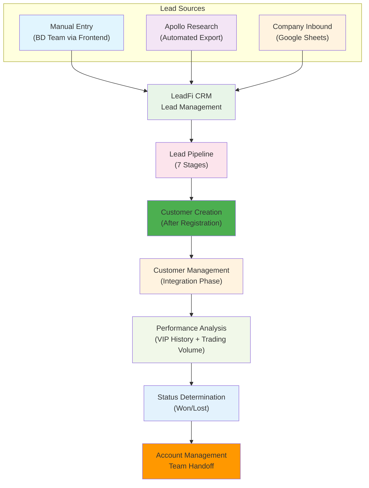
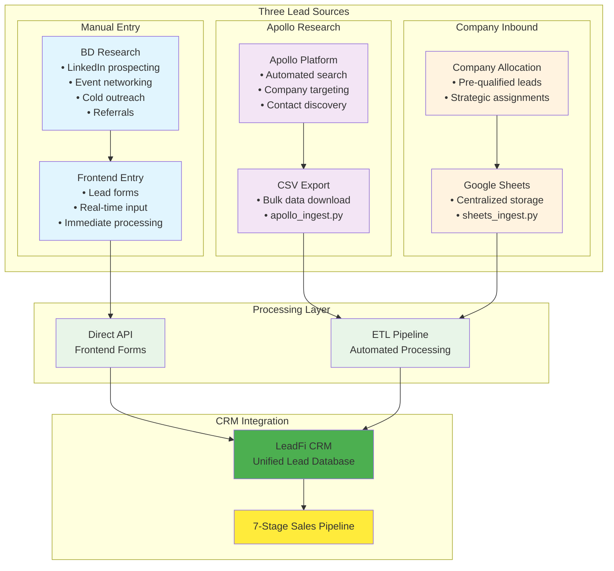
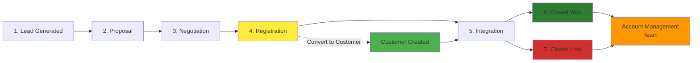
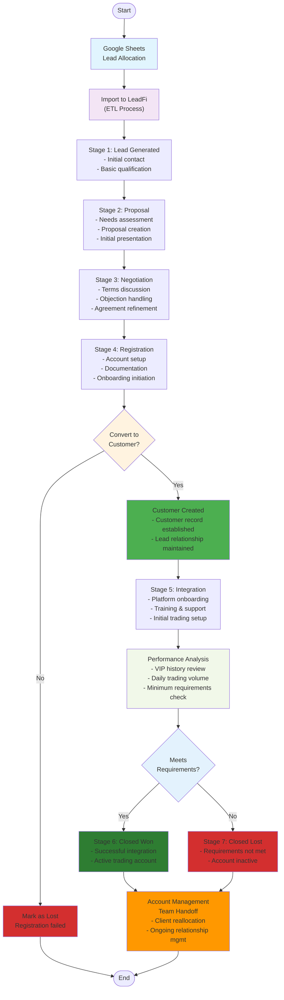

# LeadFi CRM - Workflow Overview

This document provides a comprehensive overview of the LeadFi CRM system workflow, showing how leads flow from multiple sources through the sales pipeline and transition to customer management.

## System Architecture Overview

## Lead Acquisition Methods

## Lead Pipeline Stages

## Detailed Workflow Process

## Key Components

### 1. Lead Acquisition (Multi-Source)

#### Manual Entry
- **Source**: BD team research from any external source
- **Method**: Direct frontend form input
- **Processing**: Real-time API integration
- **Examples**: LinkedIn prospecting, event networking, referrals

#### Apollo Research  
- **Source**: Apollo.io platform automated search
- **Method**: CSV export and bulk processing
- **Processing**: ETL pipeline via `apollo_ingest.py`
- **Examples**: Company targeting, contact discovery

#### Company Inbound
- **Source**: Company-allocated leads via Google Sheets
- **Method**: Centralized spreadsheet management
- **Processing**: ETL pipeline via `sheets_ingest.py`
- **Examples**: Pre-qualified prospects, strategic assignments

### 2. Sales Pipeline (Stages 1-4)
- **Lead Generated**: Initial contact and basic qualification
- **Proposal**: Needs assessment and proposal creation
- **Negotiation**: Terms discussion and agreement refinement
- **Registration**: Account setup and onboarding initiation

### 3. Customer Conversion
- **Trigger**: Successful completion of Registration (Stage 4)
- **Process**: Lead converts to Customer record
- **Relationship**: Customer maintains link to originating lead

### 4. Customer Management (Stage 5)
- **Phase**: Integration stage of the lead pipeline
- **Activities**: Platform onboarding, training, initial trading setup
- **Focus**: Customer success and platform adoption

### 5. Performance Evaluation
- **Metrics**: VIP history analysis and daily trading volume
- **Criteria**: Minimum trading requirements
- **Outcome**: Determines Won/Lost status

### 6. Final Disposition
- **Closed Won**: Requirements met, active trading account
- **Closed Lost**: Requirements not met, inactive account
- **Next Step**: Both outcomes result in handoff to Account Management team

### 7. Account Management Handoff
- **Recipients**: Account Management team
- **Scope**: Both won and lost clients for ongoing relationship management
- **Purpose**: Continued client relationship and potential reactivation

## Data Flow

1. **Multi-Source Inbound**: Manual Entry + Apollo Research + Company Google Sheets → LeadFi CRM
2. **Pipeline**: Lead progresses through 7 stages
3. **Conversion**: Registration triggers customer creation
4. **Management**: Customer management during integration
5. **Analysis**: Performance evaluation based on trading metrics
6. **Handoff**: Final reallocation to account management

## Technology Stack Integration

- **Manual Entry**: Frontend forms with real-time API
- **Apollo Research**: CSV processing and ETL pipeline
- **Google Sheets**: API integration and automated ingestion
- **LeadFi CRM**: Unified lead and customer management
- **Analytics**: Performance tracking and reporting
- **Account Management**: Post-closure relationship management

**Generated**: $(date)
**Last Updated**: $(date) 