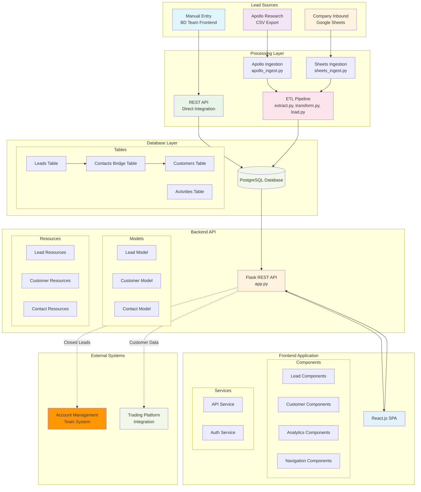
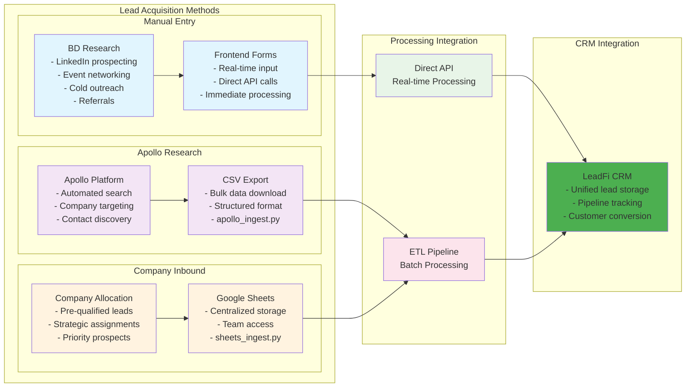
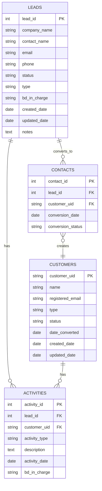
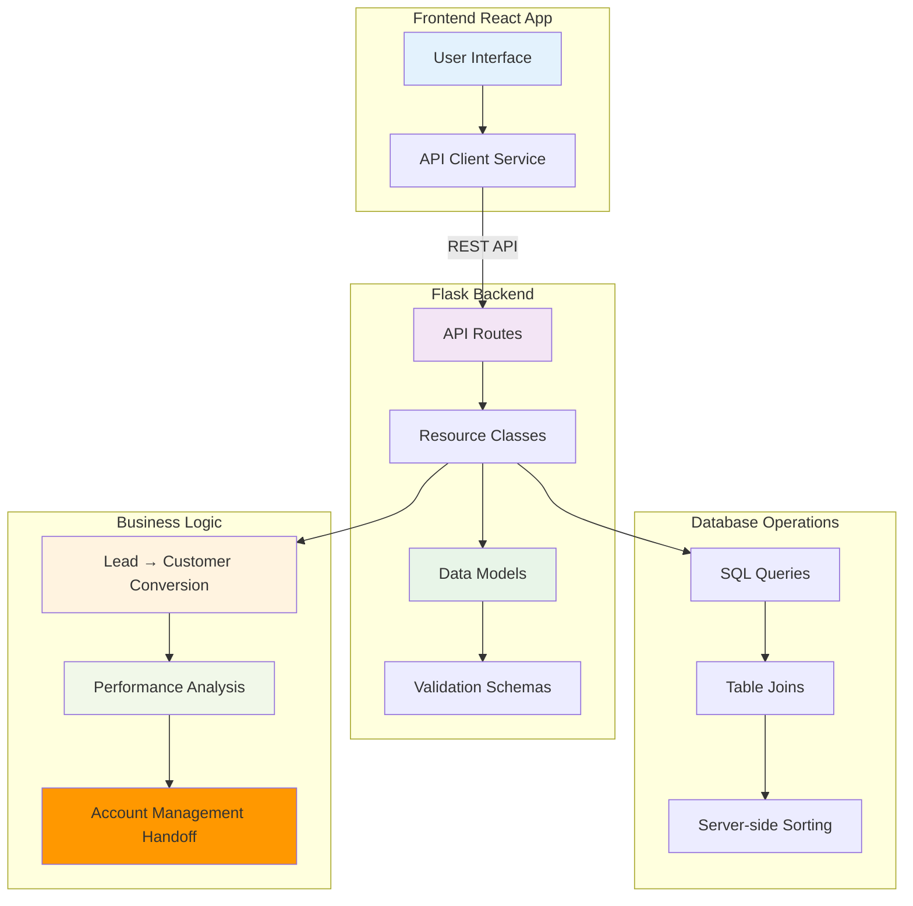
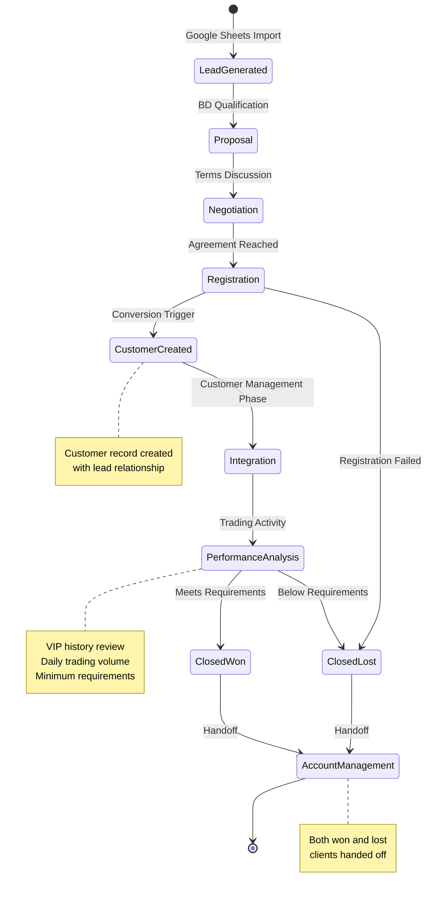

# LeadFi CRM - Technical Architecture

This document details the technical components and system architecture of the LeadFi CRM platform.

## System Architecture Overview

## Component Details

### Data Sources & Integration

### Database Schema & Relationships

### API Architecture

### Lead Pipeline & Customer Lifecycle

## Technology Stack

### Backend Technologies
- **Framework**: Flask (Python)
- **Database**: PostgreSQL
- **ORM**: SQLAlchemy
- **API**: RESTful endpoints
- **Validation**: Marshmallow schemas
- **Authentication**: JWT tokens

### Frontend Technologies
- **Framework**: React.js
- **Styling**: Tailwind CSS
- **State Management**: React Hooks
- **HTTP Client**: Axios
- **Routing**: React Router
- **Components**: Custom component library

### Data Integration
- **ETL Framework**: Custom Python scripts
- **Manual Entry**: Direct API integration via frontend forms
- **Apollo Research**: CSV processing via apollo_ingest.py
- **Google Sheets**: API integration via sheets_ingest.py
- **Data Validation**: Pandas + custom validators
- **Scheduling**: Cron jobs (future enhancement)

### Infrastructure
- **Development**: Local environment
- **Database**: PostgreSQL with custom schemas
- **API Testing**: Postman/REST clients
- **Version Control**: Git

## Key Features Implementation

### Multi-Source Lead Acquisition
1. **Manual Entry**: Real-time frontend form submission
2. **Apollo Integration**: Automated CSV processing pipeline
3. **Google Sheets**: Scheduled data synchronization
4. **Unified Storage**: All sources converge in central database

### Customer Conversion Process
1. **Trigger**: Lead reaches Registration stage
2. **Process**: Automatic customer record creation
3. **Relationship**: Maintained via contacts bridge table
4. **Data Inheritance**: Background info from lead

### Performance Analysis System
1. **Data Collection**: VIP history and trading metrics
2. **Evaluation**: Minimum requirement checks
3. **Decision Logic**: Automated won/lost determination
4. **Handoff**: Account management team notification

### Server-side Sorting & Filtering
1. **Implementation**: SQL-based sorting with joins
2. **Performance**: Optimized database queries
3. **Frontend**: Seamless sorting UI
4. **Scalability**: Handles large datasets efficiently

### URL Parameter Navigation
1. **Lead URLs**: `?lead_id=123` for direct lead access
2. **Customer URLs**: `?customer_uid=abc` for customer details
3. **Navigation**: Cross-linking between leads and customers
4. **Bookmarking**: Shareable URLs for specific records

## Security & Data Flow

### Authentication Flow
- JWT-based authentication
- Role-based access control
- Secure API endpoints
- Frontend route protection

### Data Validation
- Input sanitization
- Schema validation
- Business rule enforcement
- Error handling

### Integration Security
- **Manual Entry**: Frontend validation and API security
- **Apollo Integration**: Secure file processing and validation
- **Google Sheets**: API authentication and secure credential management
- **Data Encryption**: In transit encryption for all sources
- **Audit Logging**: Future enhancement for all lead sources

## Performance Considerations

### Database Optimization
- Indexed foreign keys
- Efficient joins for related data
- Query optimization for sorting
- Connection pooling

### Frontend Performance
- Component lazy loading
- Efficient state management
- Minimal re-renders
- Optimized API calls

### ETL Performance
- **Apollo Processing**: Batch optimization for large CSV files
- **Sheets Integration**: Incremental sync capabilities
- **Manual Entry**: Real-time processing optimization
- **Data Deduplication**: Cross-source duplicate detection

### Scalability Features
- Modular architecture
- Stateless API design
- Database normalization
- Caching strategies (future) 